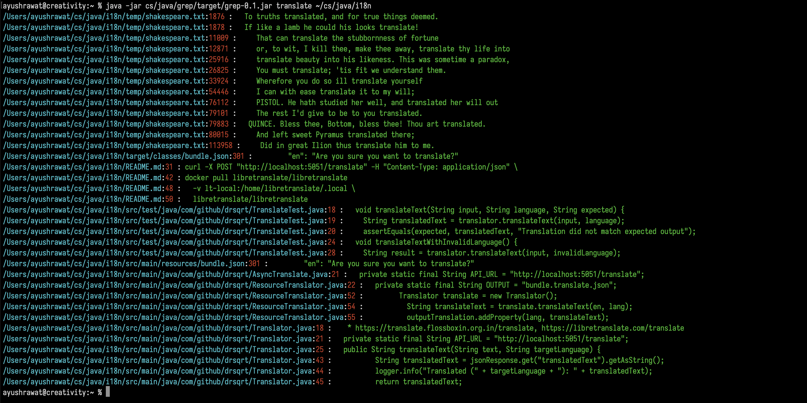

# Grep
A custom **[Grep](https://en.m.wikipedia.org/wiki/Grep)-like utility** written in Java that allows searching for keywords in files and directories.

## Quick Start
```shell
wget https://github.com/drsqrt/grep/releases/download/grep/grep-v0.1.jar &
java -jar <grep-v0.1.jar> <search-keyword> <where-to-search-in-files-or-dir>
java -jar ~/cs/java/grep/target/grep-0.1.jar todo ~/cs/grep
```

## Build
```shell
    #!/bin/bash
    
    git clone https://github.com/drsqrt/grep.git
    cd grep
    mvn clean install
    sudo chmod 744 ./bin/run.sh
    ./bin/run.sh -s searchKeyWord -f directoryPath
```


